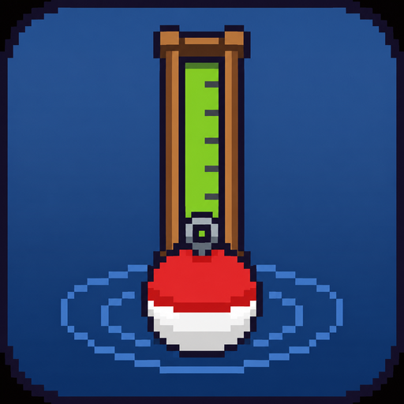

# Stardew CastMaster 🎣

Bot de pesca externo para Stardew Valley. Lê a tela com OpenCV e controla o
mouse por fora do jogo — sem mods, sem SMAPI, sem nada injetado no jogo.

*[Read in English »](README.md)*

Ele faz o ciclo de pesca inteiro sozinho: **arremessa → espera a boia →
detecta o `!` da mordida → fisga → joga o minigame → guarda o peixe → repete.**

Medido numa sessão real: **92% de controle médio** (o peixe ficou dentro da
barra o tempo todo em 13 dos 15 minigames), **94% de fisgada**, e 17 arremessos
certos contra 1 falha.

---

## Instalação

```bash
pip install -r requirements.txt
python app.py
```

Precisa de Python 3.9+ no Windows (os bipes e a hotkey global são específicos do
Windows; o resto é portável).

## Configuração do jogo — essa parte importa

- Jogo em **modo janela** (não fullscreen exclusivo);
- **Zoom 100%** e **escala de UI 100%**;
- Não mova nem redimensione a janela depois de calibrar.

## Começando

1. **Abra o jogo** e fique na beira da água onde quer pescar;
2. Rode `python app.py`;
3. Clique em **🎯 Calibrar** — abre um terminal explicando o resto: aperte
   ENTER, volte pro jogo, fisgue um peixe, e ele tira ~50 prints silenciosos
   (um bipe avisa quando começa e quando termina). Depois escolha o print em que
   o minigame aparece e desenhe uma caixa em volta da **trilha inteira** — de
   cima até embaixo, ela é mais alta do que parece;
4. Ligue **Pescar sozinho**, deixe o cursor sobre o jogo apontando pro ponto de
   pesca, e aperte **F8**.

Pronto. **F8** de novo pra parar.

## Pescar sozinho

| Switch | O que faz |
|---|---|
| **Controlar o mouse** | Desligado = o bot só *observa* e desenha o que vê. Ótimo pra conferir a detecção antes de deixá-lo jogar. |
| **Pescar sozinho** | O ciclo completo: arremessa, fisga, joga, repete. Desligado = você arremessa e fisga, o bot só joga o minigame. |

**Use o atalho F8**, não o botão Iniciar. O bot clica **onde o cursor já está**
— ele nunca move o mouse. Apertando F8 de dentro do jogo, o cursor e o foco já
estão no lugar certo e ele começa na hora. (Pelo botão, o foco fica na janela do
bot, então ele espera 5s pra você voltar pro jogo.) Dá pra trocar a tecla no
botão **trocar**.

**Enquanto roda:** não mexa no mouse nem ande com o personagem. A região do `!`
é fixa acima da cabeça dele, e a trilha aparece perto da boia — mexer em
qualquer um dos dois cega o bot. E fique de olho na **energia**: pescar gasta
stamina e o bot não sabe disso.

**Popups e travamentos:** popups que pedem clique (baú, peixe novo, recorde de
tamanho) ele dispensa sozinho e continua. Mas se o arremesso falhar 12 vezes
seguidas, tem algo travando que ele não resolve — o caso clássico é o
**inventário cheio** — então ele **para, toca um alarme** (6 bipes agudos) e
salva um print em `falha_arremesso.png` mostrando o que travou.

**Como parar:** F8, o botão Parar, fechar a janela, ou jogar o **mouse num canto
da tela** (failsafe do pyautogui).

## Registro por peixe

Escreva o nome do peixe em **Peixe atual**, deixe o bot jogar, e clique
**✔ Peguei** ou **✖ Escapou** quando o status pedir. A tabela acumula, por peixe:
tentativas, taxa de sucesso, tempo médio e **controle %** — quanto do minigame o
peixe passou dentro da barra verde.

O bot mede duração e controle sozinho; o resultado é você quem marca, porque ler
isso da tela exigiria calibrar também a barrinha de progresso. A taxa de sucesso
é calculada **só sobre os que você marcou** — os não marcados mostram `—`, não
`0%`. Fica salvo em `estatisticas.json` e persiste entre sessões.

## Como funciona

Tudo abaixo saiu de medir frames reais capturados do jogo, não de chute.

**Achar as coisas por cor.** A barra e o peixe ocupam faixas de matiz bem
separadas, então um limiar HSV simples ganha do template matching (que falhava
justo quando o peixe saía da barra — o recorte levava o verde da barra no fundo):

| | matiz | observação |
|---|---|---|
| barra do jogador | 40–70 | verde-amarelado, saturado |
| peixe | 80–100 | ciano |
| água da trilha | 110–125 | azul |

**Costurar a barra de volta.** O contorno escuro do peixe corta a barra verde na
diagonal, partindo-a em dois contornos. Pegar "o maior" fazia o centro pular até
114px — justo quando o peixe estava *dentro* da barra, que é o estado que a
gente quer. A altura denuncia: ela é fixa em 164px, mas a detecção lia 113px de
mediana, e **59% dos frames vinham partidos**. Um fechamento morfológico
vertical resolve (59% → 0%). Só essa mudança levou o controle médio de 16% para
85%.

**Controle preditivo, não liga/desliga.** A barra tem inércia pesada — medido
nos logs, ela levou 1,6s pra parar de cair mesmo sendo segurada. Reagir só
quando o peixe cruza a barra é sempre tarde: ela passa voando e depois despenca.
Então o bot mira onde a barra *vai estar*:

```
prevista = barra_y + velocidade × antecipacao     # antecipacao ≈ 0.45s
```

**Separar o `!` da barra de força.** Os dois são amarelos e aparecem na mesma
área acima da cabeça. Eles se separam pela forma — o `!` é 5×20 px (h/l ≈ 4.0),
a barra de força é ~50×25 (h/l ≈ 0.5). Validado em 296 frames: 6/6 mordidas
reais, zero falso positivo.

**Cliques têm que ser segurados.** O Stardew lê o botão do mouse uma vez por
tick (~16ms). O `pydirectinput.click()` aperta e solta em menos de 1ms e cai
*entre* os ticks — o jogo nunca vê. Todo clique segura 100ms (~6 ticks). Isso
foi descoberto por acidente num log: as fisgadas falhavam, mas o *arremesso*
(que segura 0,65s) fisgou um peixe sem querer.

**Arremesso em malha fechada.** O bot segura o botão e confirma que a barra de
força realmente apareceu antes de acreditar que arremessou. Clicar no escuro
"pra dispensar popup" dava um arremesso fraco quando não havia popup, e isso
emperrava o ciclo.

## Arquivos

| Arquivo | Papel |
|---|---|
| `app.py` | A interface e o loop do bot |
| `deteccao.py` | Acha a barra, o peixe, o `!` e a barra de força |
| `calibrar.py` | Localiza a trilha na *sua* tela → `config.json` |
| `amostra.py` | Diagnóstico: grava frames de tela cheia enquanto você pesca |
| `imgio.py` | Leitura/escrita de imagem à prova de acento (veja abaixo) |
| `bot.py` | Versão sem interface, só o minigame |

## Pegadinhas que vale saber

**O OpenCV falha em silêncio com acento no caminho.** No Windows, o
`cv2.imread` / `cv2.imwrite` usam caminhos ANSI, então qualquer caractere
acentuado faz eles retornarem `None` / `False` **sem lançar erro**. Este projeto
mora em `Área de Trabalho`, o que quebrava o carregamento do template e fazia o
app dizer que não estava calibrado quando estava. O `imgio.py` faz o I/O pelo
numpy.

**O Tkinter não é thread-safe.** O callback da hotkey roda na thread da lib
`keyboard`; chamar `after()` de lá levanta *"main thread is not in main loop"*.
Aquela thread só deposita um pedido numa fila — quem age é o refresh da UI, já
na thread do Tk.

**A região da trilha é fixa.** O Stardew desenha o minigame perto da boia, então
arremessar de outro ponto ou com força bem diferente coloca a trilha noutro
lugar e o bot fica cego. Arremesse do mesmo lugar. Achar a trilha
automaticamente é o próximo passo natural.

## Roadmap

- Achar a trilha do minigame sozinho, em vez de depender de uma região fixa;
- Ler a barrinha de progresso da captura, pra o bot saber se ganhou sem você
  marcar;
- Pegar o baú de tesouro quando aparecer (a segunda barra do minigame);
- Detectar especificamente a tela de inventário cheio, em vez de inferir o
  travamento por falhas repetidas de arremesso.
